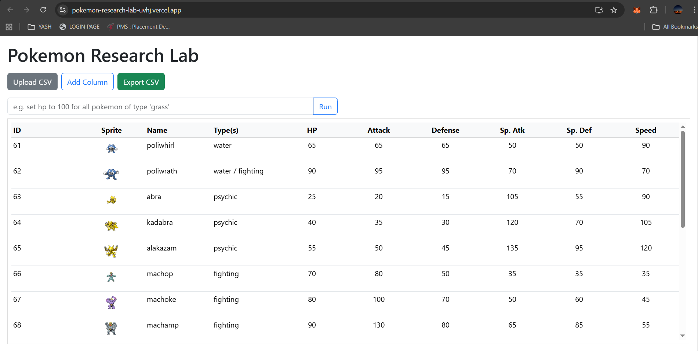
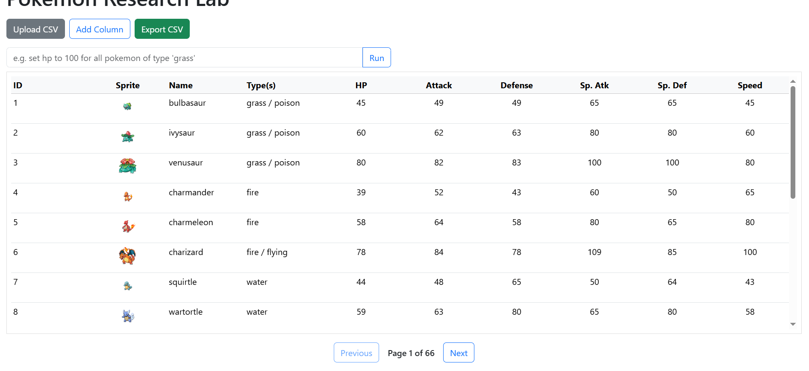
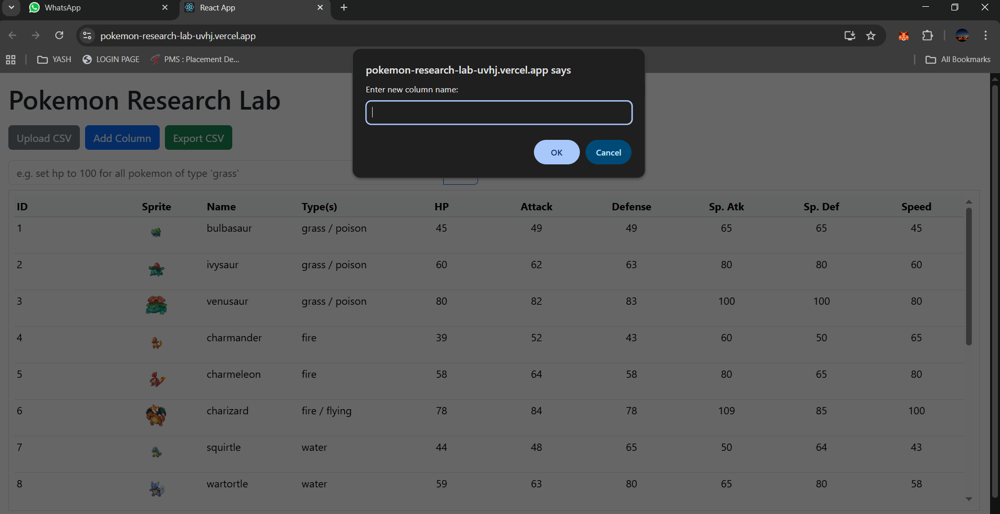
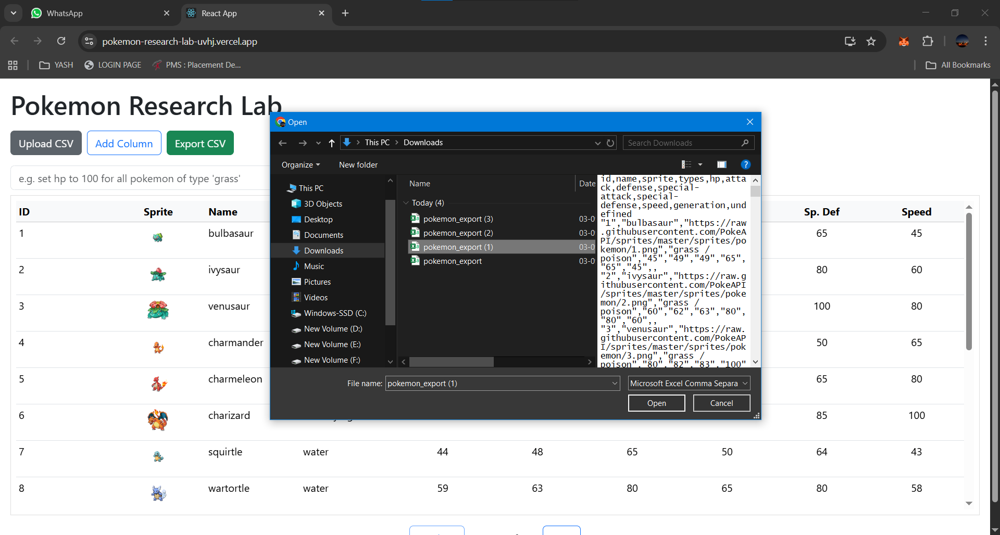

Pokémon Research Lab

    A high-performance React + JavaScript web app for exploring and analyzing Pokémon data.
    Built with React, Zustand, TanStack, PapaParse, Bootstrap and deployed on Vercel.

👉 Live Demo: your-project-url.vercel.app

🚀 Features

        Automatic Data Fetching with Pagination
        Loads Pokémon data 20 at a time from PokéAPI
        .

        Virtualized Table
        Super smooth scrolling for 1000+ rows.

        CSV Import & Export

        Upload your own Pokémon CSV.

        Map CSV headers to fields.

        Export current dataset anytime.

        Custom Columns
        Add new fields dynamically (Text, Number, Boolean).

        Inline Editing
        Double-click a cell → edit values → instantly updates state.

🛠️ Tech Stack

        Frontend: React (JavaScript)

        State Management: Zustand

        Data Fetching: @tanstack/react-query

        Virtualized Table: @tanstack/react-virtual

        CSV Parsing: PapaParse

        CSV Export: file-saver

        Styling: Bootstrap

📦 Installation & Setup

        Follow these steps to set up the project locally:

        1. Clone the repository
            git clone https://github.com/your-username/pokemon-research-lab.git
            cd pokemon-research-lab

        2. Install dependencies

            Run this once to install all required libraries:

            npm install

            Here’s what gets installed:

            react, react-dom → React core

            zustand → State management

            axios → API requests

            @tanstack/react-query → Data fetching/caching

            @tanstack/react-virtual → Table virtualization

            @tanstack/react-table → Table utilities

            papaparse → CSV parsing

            file-saver → CSV export

            bootstrap → Styling

            (If you’re missing any module later, install with npm install <package-name>)

        3. Run development server
            npm start

            App will run at: http://localhost:3000

            Supports hot reloading (changes reflect instantly).

        4. Build for production
             npm run build

            Optimized files will be created in the build/ folder.

Project Structure
        pokemon-research-lab/
        ├── src/
        │   ├── components/       
        │   │   ├── MainPanel.jsx
        │   │   ├── PokemonTable.jsx
        │   │   ├── CSVUploader.jsx
        │   │   ├── AddColumnButton.jsx
        │   │   ├── ExportButton.jsx
        │   │   ├── AICommandBox.jsx
        │   │
        │   ├── store/            
        │   │   └── useStore.js
        │   │
        │   ├── utils/            
        │   │   ├── fetchPokemonPage.js
        │   │   ├── exportCSV.js
        │   │   └── parseCommand.js
        │   │
        │   ├── App.js
        │   ├── index.js
        │
        ├── public/
        ├── package.json
        └── README.md

y📊 Usage

        Browse Data → Pokémon load automatically (20 per page).

        Import CSV → Upload your own dataset.

        Export CSV → Save modified dataset.

        Add Column → Add custom fields to the table.

        Edit Inline → Double-click any cell to edit.

        Run Commands → Use AI Command Box for bulk updates.

🌍 Deployment
        🔹 Deploy on Vercel (1-Click)

📸 Screenshot
        
        
        
        